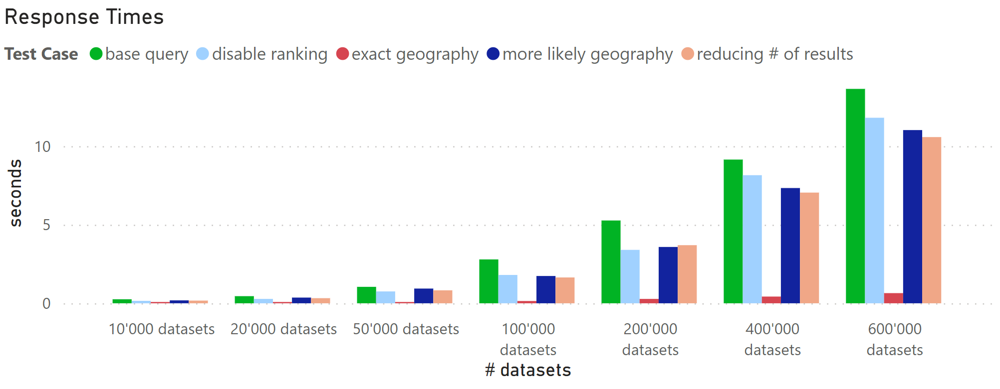

# Benchmarking

In order to evaluate the quering cost of the features required by the use case, we constructed a series of benchmarking tests found here.

## Installation
```bash
pip install requests
```

## Usage
1. start a GraphDB instance (locally or hosted)
2. adjust the link to GraphDB to your test-setup (line 190) of 
3. upload the provided repository to GraphDB (*entries.ttl files)[^1]
4. run the program with:

```bash
python benchmarking.py
```

5. analyse the resulting test_results.csv file

## Different test cases
In the program several test cases are tested:
1. the base case according to the specification &rarr; base case
2. reducing the number of query result by making the description more accurate &rarr; reduce # of results
3. instead of taking a specific city (e.g. Paris), take France instead &rarr; more likely geography
4. remove the bGeographyParent feature &rarr; exact geography
5. remove the ranking calculation &rarr; disable ranking

## Results
A graphical illustration of the results can be found here:
 
It can be clearly seen, that the biggest reduction of the query cost can be achieved with querying only for exact geography (without using the bGeographyParent feature). However, this is a core part of the ontology and thus unremovable. Nonetheless the results can indicate a direction towards performance optimization.


[^1]: If you need more than the 200_000 entries, please contact the publisher of the paper.